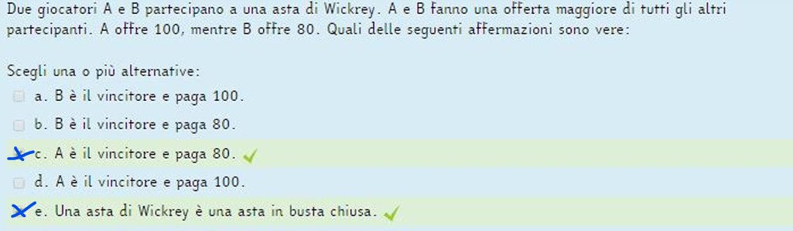

a. V: per ogni mondo raggiungibile è vero che ho p o q
b. F: p non è in tutti e due
c. F: non c'è una lettera uguale in tutti e due
d. V: da w4 e w2 che posso raggiungere vale quadrato p ovvero quelli che loro possono raggiungere hanno tutti p

   

perchè refuse fa la release di cfp

   

Adding first behaviour

Adding second behaviour

Adding third behaviour

0
...
20

nota: no Bye perchè non è stata chiamata doDelete()

   

   

   

   

   

   

   

   

   

   

   

   

   

   

   

   

   

   

   

   

   

   

A
request -> niente
quote -> {C(m,c,accept,goods)}
accept -> {C(m,c,T,goods), C(c,m,goods,pay)}

B
request -> niente
quote -> {C(m,c,accept,goods)}
goods -> {rimuove C(m,c,accept,T), C(m,c,pay,receipt)}
= {C(m,c,pay,receipt)}

C
quote -> {C(m,c,accept,goods)}
accept -> {C(m,c,T,goods), C(c,m,goods,pay)}
goods -> {rimuove C(m,c,T,T), C(c,m,T,pay), C(m,c,pay,receipt)}
pay -> {rimuove C(c,m,T,T), C(m,c,T,receipt)}
receipt -> {rimuovere C(m,c,T,T)}
= {} valida

   

   

   

   

   

   

a. p2, p3, {X /c}
b. p3, {X /c, Y/b, Z/c}
c. move(b,c); !location(robot, c)

   

<!-- TODO pag52 -->

   

   

   

   

   

l'agente i
ha come persistent goal ϕ se ϕ è un achievement goal e prima di abbandonare il
goal o crede di averlo raggiunto o crede che non sia raggiungibile (mai vero nel
futuro);

   

   

   

- Assioma K: □(ϕ =⇒ ψ) =⇒ (□ ϕ =⇒ □ψ). Questo è un assioma fondamentale,
  sempre vero, che prende il nome in onore di Kripke e ci permette di portare dentro
  l'operatore □;
- Necessitation: ϕ ⊢ □ ϕ. Questa è una regola di inferenza che afferma che se ϕ è valida
  e quindi una tautologia allora è necessariamente vera

   

   

   

   

   

   

   
