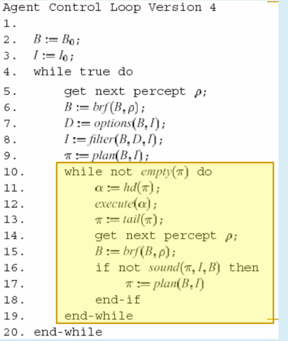

Rodney Brooks ha proposto la subsumption architecture come risposta ai limiti dell'IA simbolica, che richiede rappresentazioni e ragionamenti espliciti. Brooks sostiene che l'intelligenza emerga come proprietà dei sistemi complessi attraverso l'interazione con l'ambiente, senza bisogno di linguaggi logici, non è una proprietà innata.

inoltre dice che lintelligenza deriva dalla capcità di astrarre, capire cosa è rilevante che per ora nellai simbolica è delegata all'uomo.

La subsumption architecture è una gerarchia di task con behaviours semplici che competono per controllare l'agente. Ogni behaviour è definito da una coppia (c, a), dove c sono le condizioni di percezione e a l'azione corrispondente. Gli strati inferiori gestiscono comportamenti più primitivi con priorità su quelli superiori(inferiori inibiscono superiori).
Subsunction sta per il fatto che ogni livello sussume i livelli inferiori aggiunge comportamenti più complessi.

esempio rover con gradiente

   

Diaciamo che una strategia è dominante se il suo risultato in termini di payoff è il migliore possibile indipendentemente dalle scelte degli altri giocatori. È irrazionale non scegliere una strategia dominante se esiste.
Inoltre si uò dire che una strategia domina fortemente un'altra se il suo payoff è maggiore in tutti i casi(scelta degli altri giocatori). Una strategia domina debolmente un'altra se il suo payoff è maggiore in almeno un caso e non è minore in nessun caso.

Guardando la matrice di payoff possiamo vedere che per Alice se Bob sceglie b1, a1 è la strategia migliore, mentre se Bob sceglie b2, a2 è la strategia migliore. Quindi non esiste una strategia dominante per Alice. Lo stesso si può dire per Bob.

 <!-- Se entrambi i giocatori scelgono la strategia dominante, si raggiunge il punto di Nash, in cui nessuno ha interesse a cambiare la propria strategia. -->

   

Per stategia pura si intende l'utilizzo di una politica deterministica, in ogni situazione si determina la singola prossima azione da eseguire, questo potrebbe portare a non trovare un equilibrio(somma zero).
Una strategia mista è una distribuzione di probabilità (che somma a 1) su tutte le azioni possibili. Ogni azione ha una probabilità associata, e l'agente sceglie l'azione in base a questa distribuzione.
Nash dimostra che ogni gioco in cui ogni giocatore ha un insieme finito di strategie possibili ha un equilibrio con strategie miste, il problema è trovare questo equilibrio e con quale complessità.

   

Se io ricevo un messaggio da agent che mi richiede di eseguire action al tempo time, e io credo che

- agent attualmente è un amico
- io so eseguire action, ne ho la capacità(è tra le mia capabilities)
- al tempo time non sono impegnato a eseguire qualunque altra azione

allora mi impegno (commit) ad eseguire action at tempo time

   

<!-- TODO -->

   

Siamo nel contesto della comunicazione tra agetti dove questa permette agli agenti di coordinare le loro azioni e i loro comportamenti.
Questa abilità è parte della percezione (ricevere messaggi) e parte delle azioni (inviare messaggi)

La coordinazione è quindi una proprietà di un sistema multiagente che eseguono attività su un ambiente condiviso.
La coordinazione può essere di due tipi:
-cooperativa: gli agenti sono non antagonisti e cercano di raggiungere un obiettivo comune
-competitiva: gli agenti sono antagonisti, competitivi o semplicemente
self-interested (es. aste)

   

L’architettura di TOURINGMACHINES proposta da Ferguson consiste di sottosistemi di
percezione e azione che si interfacciano direttamente con l’ambiente dell’agente e tre control
layers, inseriti in un control framework, che media fra gli strati.

Il Reactive Layer contiene un insieme di regole if-then, simile alla subsumtion architecture.

Il Planning Layer costruisce piani e sceglie azioni da eseguire per raggiungere i goal.

Il Modelling Layer contiene la rappresentazione simbolica del mondo e degli stati cognitivi di altre entità nell’ambiente dell’agente.

Il Control Subsystem permette ai precedenti 3 layer di comunicare tra di loro, inserendoli anche in un control framework che usa control rules (va a inibire i layer).

   

   

Seguendo e sostenendo le teorie
di Bratman, Cohen e Levesque ritengono che il comportamento razionale dovrebbe essere
analizzato in termini di beliefs, desires and intentions (BDI).
Come ogni Logica Modale anche questa basa la semantica sui mondi possibili che si appog
giano però ad una Logica Temporale lineare. I mondi infatti non sono classici insiemi di
proposizioni vere nel mondo, bensì sequenze discrete di eventi che si estendono all’infinito
nel passato e nel futuro. I mondi sono connessi attraverso le relazioni BEL, GOAL, ecc...
mentre il ragionamento in un mondo è basato sulla logica temporale LTL.
Per stabilire la verità di formule dovrò, dato un modello, prendere in considerazione un
suo mondo ed un suo istante temporale.
Abbiamo 2 operatori mentali BEL e GOAL, 2 operatori suazioni HAPPENS e DONE 2 operator temporali LATER e BEFORE, da tutti questi posso derivare operatori complessi come A-GOAL, P-GOAL e INTEND.

   

   

Sia Alice che Bob hanno una strategia dominante, quella di testimoniare. Presa ad esem
pio Alice, se fosse razionale, analizzerebbe la matrice con il seguente ragionamento:

- se Bob testimoniasse mi prenderei: 5 anni se testimoniassi anche io e 10 in caso con
  trario. Quindi in questo caso è meglio testimoniare;
- seBobinvecesi rifiutasse di testimoniare mi prenderei: 0 anni nel caso in cui decidessi
  di testimoniare e 1 anno se mi rifiutassi. Anche in questo caso testimoniare è meglio.

In definitiva, in entrambi i casi è meglio testimoniare, per cui lo farà. Se Alice è furba,
oltre che razionale, potrà continuare a ragionare come segue: anche per Bob la strategia
dominante è testimoniare. Quindi, lui testimonierà ed entrambi saremo condannati a 5
anni. Il dilemma è che il risultato è peggiore,-5 per ciascun giocatore, del risultato che
entrambi otterrebbero se si rifiutassero di testimoniare, cioè -1 per entrambi. La strategia
(A : refuse,B : refuse) è pareto ottima, mentre (A : tesify,B : testify) non lo è.

   

B := B0

I := I0

while true do

get next perception p;

B := brf(B, p);

D := options(B, I);

I := filter(B, D, I);

pigreco := plan(B, I);

execute(pigreco);

end while

   

Per ora il nostro agente è fanatico poichè quando
determina un piano lo porta sempre a termine completamente. Il ciclo di controllo dell'agente è inoltre overcommitted ossia è impegnato in maniera eccessiva sia nei fini (intenzioni) che
nei mezzi (piano), dato che non li rimette mai in discussione. Iniziamo ad introdurre la
possibilità di ripianificare se necessario e di riconsiderare le intenzioni rispetto alle nuove
percezioni che possiamo avere dopo l'esecuzione di un'azione del piano con la versione 4

   

l'agente
i intende compiere l'azione α se ha un goal persistente di raggiungere uno stato
in cui lui aveva appena creduto di stare per eseguire α, e subito dopo α viene
eseguita. Il criterio che l’agente sia committed a credere di stare per eseguire
l’azione α, evita che l’agente sia tenuto ad eseguire l’azione accidentalmente o
senza pensarci.

   

Per un agente posso definire tutti i Behaviours che voglio
che saranno portati avanti in parallelo facendo un passo per volta per ogni task.
Dato che ogni agente ha un solo thread la parallelizzazione tra i tasks è simulata dallo scheduler.
Lo scheduler dei Behaviours non è preemptive e, in quanto cooperativo, il metodo action() viene sempre eseguito completamente.
Il fatto che ogni agente sia su un solo thread non è limitativo poichè ovviamente le sue azioni
sono collaborative tra di loro, non in competizione. Sarà quindi il singolo agente che decide
l'ordine delle azioni che vuole compiere. Agenti diversi, in competizione tra loro, saranno
su threads distinti.

   

autonomo

ambiente

obbiettivi

il fatto che quello che fa lagente modifica lambientequindi influisce sulle percezioni future

   

   

Il practical reasoning ragiona sulle azioni, sul processo di capire cosa fare mentre il theoretical reasoning ragiona sulle credenze.

   

   

#### Differenza agente e programma

Un programma è un insieme di istruzioni che vengono eseguite su un computer per risolvere un problema. Un agente è un sistema di computazione capace di agire autonomamente in qualche ambiente con il fine di raggiungere gli obbiettivi per cui è progettato.

INtelligente lo è se esegue azioni autonome in modo flessibile in un abbiente, dove per flessibile intendiamo: reattivo, proattivo e sociale.

guadare slide
